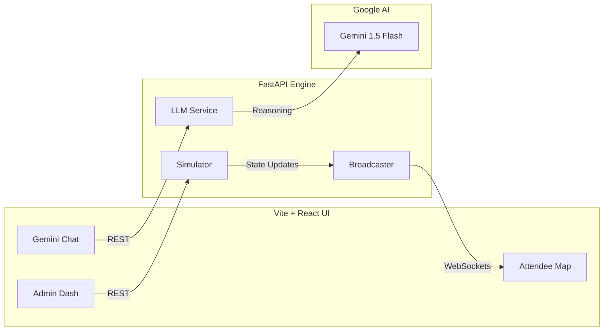

<div align="center">

# 🏟️ CrowdSense AI 

**Real-time Crowd Intelligence & AI-Driven Venue Management**

[](https://fastapi.tiangolo.com/)
[](https://react.dev/)
[](https://ai.google.dev/)
[](https://cloud.google.com/run)

---

### "CrowdSense reasons about the venue, communicates in plain language, and acts before the congestion peaks."

[Live Demo](https://crowdsense-frontend-417095097143.asia-south1.run.app) • [Backend API](https://crowdsense-backend-417095097143.asia-south1.run.app/docs) • [Architecture](#-architecture)

</div>

---

## 🚀 The Vision

Modern sports and entertainment venues suffer from "Post-Game Congestion" and "Half-Time Gridlock." **CrowdSense AI** solves this by bridging the gap between raw stadium data and actionable intelligence.

It doesn't just show you a map; it **reasons** about crowd flow using the **Gemini 1.5 Flash** model, pushing proactive "nudges" to attendees and operational "actions" to staff—all in real-time.

---

## ✨ Key Features

- **🗺️ Interactive Heatmap**: A high-performance SVG-based stadium map with 14 distinct zones (Gates, Concessions, Restrooms, Exits).
- **🧠 AI-Powered Nudges**: Gemini-driven notifications that suggest quieter zones and shorter queues to attendees dynamically.
- **💬 Context-Aware Chat**: A built-in AI assistant grounded in live stadium data. Ask it "Where should I go for coffee?" and it checks wait times for you.
- **⚡ Real-Time Simulation**: A robust Python backend simulating 14 zones with profiles for Pre-Game, In-Play, Half-Time, and Full-Time.
- **🛠️ Admin Command Center**: A management dashboard to trigger stadium events and monitor AI-suggested staff actions for every zone.

---

## 🏗️ Architecture

CrowdSense AI is built for massive scale using a decoupled, event-driven architecture.



---

## 🛠️ Tech Stack

| Layer | Tools | Why? |
| :--- | :--- | :--- |
| **Frontend** | React 18 / Vite / Vanilla CSS | Ultra-fast rendering with premium glassmorphism aesthetics. |
| **Backend** | Python 3.11 / FastAPI | High-concurrency WebSockets for live data streaming. |
| **Intelligence**| Gemini 1.5 Flash | The industry-leading model for low-latency reasoning and instructions. |
| **Infrastructure**| Google Cloud Run | Fully serverless, containerized deployment in the Mumbai region (`asia-south1`). |
| **Real-time** | WebSockets (WS/WSS) | Persistent bi-directional data flow with auto-reconnection. |

---

## 🚀 Deployment (Production State)

The system is fully containerized and ready for production on **Google Cloud Run**.

### Backend Setup
The backend utilizes `uvicorn` and listens to dynamic port environments provided by Cloud Run.
```bash
gcloud run deploy crowdsense-backend --source ./backend --region asia-south1
```

### Frontend Setup
The frontend is built with Node.js and served via a high-performance **Nginx** container configured for Single Page Applications (SPA).
```bash
gcloud run deploy crowdsense-frontend --source ./frontend --region asia-south1
```

---

## 📸 Technical Highlights

### **Dynamic Density Formula**
Zones use a sinusoidal noise term to simulate the "natural swell" of human movement:
`density = (target × 100) + sin(t × 0.3 + phase) × 8 ± 3`

### **AI Grounding**
We use a "State-to-Text" injection method where the live simulation state is serialized to JSON and provided as grounding context to Gemini for every user interaction.

---

<div align="center">
Built with ❤️ for the Hackathon by <b>Sneha Srinivas</b>.
</div>
